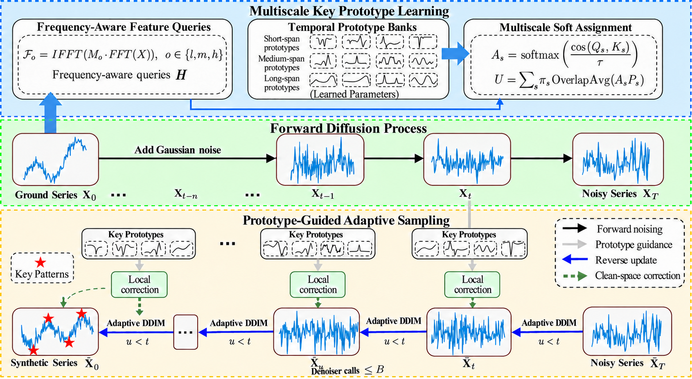

<div align="center">

# K-ProtoDiff+
### Multiscale Prototype-Guided Diffusion for Time Series Generation

**Learn local patterns at multiple scales. Guide generation with temporal prototypes.**

[](#installation)
[](#installation)
[](#overview)

[Overview](#overview) | [Quick start](#quick-start) | [Datasets](#datasets) | [Evaluation](#evaluation) | [Citation](#citation)

</div>

---

## Overview

**K-ProtoDiff+** generates multivariate time series using learned temporal prototypes to guide diffusion. It extends the conference K-ProtoDiff framework with **multiscale temporal prototype banks** and **adaptive reflection sampling**: the same reconstructed temporal context guides the denoiser and identifies regions that need local refinement during generation.

<p align="center">
  
</p>

| Component | Role |
| :--- | :--- |
| **Frequency-aware queries** | Construct assignment features from low-, medium-, and high-frequency components. |
| **Multiscale prototype banks** | Learn representative temporal snippets at different durations. |
| **Aligned prototype guidance** | Reconstruct overlapping windows and combine them into context aligned with the sequence. |
| **Adaptive reflection** | Use prototype disagreement, temporal roughness, and denoising progress to control local correction and sampling strides. |

This repository provides the model, dataset configurations, training and generation entry point, and evaluation utilities. Standard configurations cover **10 datasets**; a synthetic sine configuration supports a quick smoke run.

> **Reproduction scope.** These are standard configurations, rather than the complete tuned paper experiment suite. The evaluation notes below describe differences that matter when comparing published results. GPU training has not been revalidated during repository cleanup.

## Quick start

### Installation

Use **Python 3.11** and an **NVIDIA CUDA GPU** for training and generation. Run all commands from the repository root.

```bash
git clone https://github.com/YaofireJinglian/K-ProtoDiff-Plus-.git
cd K-ProtoDiff-Plus-

python -m venv .venv
source .venv/bin/activate
python -m pip install torch==2.7.1 --index-url https://download.pytorch.org/whl/cu128
python -m pip install -r requirements.txt
```

On Windows, activate the environment with `.venv\Scripts\Activate.ps1` in PowerShell. The CUDA wheel must be compatible with your GPU and driver. The paper experiments used a single NVIDIA GeForce RTX 5090 under Ubuntu 24.04; the dependency commands above follow the source project's environment.

<details>
<summary><b>Optional dependencies</b></summary>

- Install `requirements-eval.txt` for the TensorFlow-based discriminative and predictive metrics.
- Legacy MuJoCo helpers require `dm-control`.
- Legacy JacobiKAN helpers require `torchinfo`.

The standard configurations do not use the latter two helpers.

</details>

### Download data

```bash
python scripts/download_paper_datasets.py
python scripts/download_fmri_dataset.py
```

The first command downloads the public CSV/EEG datasets; the second downloads fMRI separately. Files are stored in `Data/datasets/`. Downloads require network access, and each dataset remains subject to its upstream terms.

### Train and generate

Start with the Stocks configuration:

```bash
# Train
python run.py --name stocks --config_file Config/journal/stocks.yaml --gpu 0 --seed 2026 --train

# Generate from the final checkpoint
python run.py --name stocks --config_file Config/journal/stocks.yaml --gpu 0 --seed 2026 --milestone 10
```

| Output | Location |
| :--- | :--- |
| Checkpoints | `checkpoints/journal/Checkpoints_journal_stocks_24/` |
| Generated normalized sequences | `OUTPUT/stocks/ddpm_fake_stocks.npy` |
| Normalized reference windows | `OUTPUT/stocks/samples/stocks_norm_truth_24_train.npy` |

Stocks trains for **12,000 optimizer steps** and saves every **1,200 steps**, so milestone **10** is the final checkpoint. `max_epochs` denotes optimizer steps in these configurations. For other datasets, use `max_epochs / save_cycle` to identify the final milestone. The solver appends the sequence length to `solver.results_folder`.

<details>
<summary><b>Try a two-step synthetic smoke run without downloading data</b></summary>

```bash
python run.py --name sine_smoke --config_file Config/sines_journal.yaml --gpu 0 --train solver.max_epochs 2 solver.save_cycle 1 dataloader.train_dataset.params.num 256
python run.py --name sine_smoke --config_file Config/sines_journal.yaml --gpu 0 --milestone 2 dataloader.train_dataset.params.num 256
```

This checks the training-to-generation workflow; two optimization steps are insufficient for meaningful generation quality.

</details>

<details>
<summary><b>Configuration overrides and independent seeds</b></summary>

Put dotted configuration overrides at the end of a command. For independent runs, change both `--name` and `solver.results_folder` to keep generated samples and checkpoints separate:

```bash
python run.py --name stocks_seed2027 --config_file Config/journal/stocks.yaml --gpu 0 --seed 2027 --train solver.results_folder ./checkpoints/journal/stocks_seed2027
```

`--seed` controls model randomness. Dataset splitting uses the seed in the dataset configuration where supported.

</details>

## Datasets

Choose a configuration under [`Config/journal/`](Config/journal/) to switch datasets.

| Dataset | Configuration | Dataset | Configuration |
| :--- | :--- | :--- | :--- |
| ETTh | [etth.yaml](Config/journal/etth.yaml) | Electricity | [electricity.yaml](Config/journal/electricity.yaml) |
| Energy | [energy.yaml](Config/journal/energy.yaml) | Traffic | [traffic.yaml](Config/journal/traffic.yaml) |
| Weather | [weather.yaml](Config/journal/weather.yaml) | Illness | [illness.yaml](Config/journal/illness.yaml) |
| Exchange | [exchange.yaml](Config/journal/exchange.yaml) | Stocks | [stocks.yaml](Config/journal/stocks.yaml) |
| EEG | [eeg.yaml](Config/journal/eeg.yaml) | fMRI | [fmri.yaml](Config/journal/fmri.yaml) |

For generated sine waves, use [`Config/sines_journal.yaml`](Config/sines_journal.yaml).

## Evaluation

```bash
python -m pip install -r requirements-eval.txt
python scripts/eval_seeded.py --root OUTPUT/stocks/evaluation --ori_path OUTPUT/stocks/samples/stocks_norm_truth_24_train.npy --fake_path OUTPUT/stocks/ddpm_fake_stocks.npy --seed 2026
```

| Metric | Aspect evaluated |
| :--- | :--- |
| **Context-FID** | Distributional similarity in a learned representation space |
| **KL divergence** | Agreement between estimated value distributions |
| **Discriminative score** | Distinguishability of real and generated sequences |
| **Predictive score** | Predictive utility of generated sequences |
| **Segment-wise DTW** | Local temporal shape agreement |

Inputs must have shape **`(samples, time, features)`** and use the same normalization. Context-FID uses CUDA device 0. Discriminative and predictive scores require TensorFlow; append `--skip ds ps` to omit them if it is unavailable.

> **Protocol note.** The example compares generated samples against training data, rather than a held-out set. The evaluator's KL and segment-wise DTW implementations are reference versions and may differ from the paper's definitions. Check the evaluation protocol before comparing these outputs with published numbers.

## Tests

```bash
python -m unittest discover -s tests -v
```

Tests cover configuration consistency, frequency reconstruction, prototype gradients, and the adaptive sampler's evaluation budget. They require no downloaded datasets, and core model tests can run on CPU.

## Repository guide

```text
K-ProtoDiff-Plus-/
|-- Config/                 # Dataset and synthetic-data configurations
|-- Models/                 # Prototype-guided diffusion model
|-- Layer/                  # Training engine and supporting layers
|-- Data/                   # Data loading and downloaded datasets
|-- Utils/                  # Data processing and metric utilities
|-- scripts/                # Downloads, evaluation, and baseline restoration
|-- tests/                  # Model and configuration checks
|-- docs/assets/            # README framework figure
|-- baseline_patches/       # Patches for optional external baselines
|-- baselines.lock.json     # Pinned baseline sources
`-- run.py                  # Training and generation entry point
```

<details>
<summary><b>Restore optional external baselines</b></summary>

```bash
python scripts/restore_baselines.py
```

This creates `baselines/` from pinned sources. Follow each upstream project's instructions and environment to run it. The restore script refuses to overwrite existing repositories.

</details>

## Citation

K-ProtoDiff+ is the journal extension of **K-ProtoDiff: Key Prototypes-Guided Diffusion for Time Series Generation**. The following entry cites the **conference predecessor**, published at AAAI 2026:

```bibtex
@article{duan2026kprotodiff,
  title   = {K-ProtoDiff: Key Prototypes-Guided Diffusion for Time Series Generation},
  author  = {Duan, Yuhang and Lin, Lin and Wu, Xiaoshuai},
  journal = {Proceedings of the AAAI Conference on Artificial Intelligence},
  volume  = {40},
  number  = {25},
  pages   = {20959--20967},
  year    = {2026},
  doi     = {10.1609/aaai.v40i25.39237}
}
```

## Acknowledgments and licensing

This implementation includes code derived from research projects including **Diffusion-TS** and **TS2Vec**. Retain the source attribution and consult the corresponding upstream licenses. External baseline repositories retain their own licenses. A project-wide license has not yet been selected by the maintainer.
